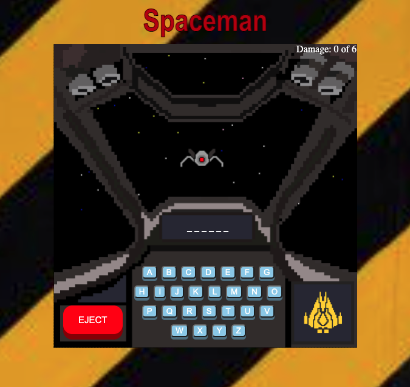

[Spaceman Repository](https://github.com/aharri64/Spaceman)

[Spaceman Deployed Site](https://aharri64.github.io/Spaceman/)

Spaceman is a sightly less gruesome version of hangman. This was my first full application completely built on my own. It was built with HTML, CSS, and vanilla JavaScript.

This game was made in a four day solo sprint. It is a fully functional and immersive hangman game with a responsive design. In order to create a more unique and individualized look and feel to the game I decided that the user would be a pilot in a space fighter in a dog fight with an enemy fighter. To achieve this, I utilized photoshop and layered a block grid in order to use the fill tool to create pixels. The buttons were created by maping them out utilizing javascript and not HTML.

